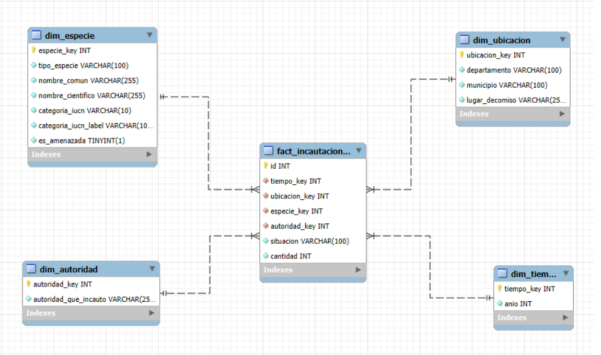

*Proyecto ETL - ODS 15: Vida de Ecosistemas Terrestres*

Por:

-Jose David Santa

-Valentina Morales

-Brayan Stiven Tigreros

**Objetivo del proyecto**

El propósito de este proyecto es diseñar e implementar un pipeline ETL en entorno de producción que integre y analice datos de incautaciones de fauna silvestre en los departamentos de Risaralda y Caldas, Colombia, junto con información externa sobre el estado de conservación de las especies. Este sistema se desarrolla en el marco de los Objetivos de Desarrollo Sostenible (ODS 15: Vida de Ecosistemas Terrestres), con el fin de generar conocimiento que contribuya a la protección de la biodiversidad y la lucha contra el tráfico ilegal de especies y la extinción de ellas.
Desde su concepción, el pipeline está diseñado para trabajar con múltiples fuentes de datos que se complementan entre sí. Por un lado, se cuenta con datasets en formato CSV que registran las incautaciones de fauna silvestre realizadas por autoridades en Risaralda y Caldas. Por otro lado, se integra información proveniente de la API de Global Biodiversity Information Facility (GBIF), la cual proporciona el estado de conservación de las especies según estándares internacionales como la Lista Roja de la Unión Internacional para la Conservación de la Naturaleza.
La integración de estas fuentes permite enriquecer significativamente el análisis, ya que no solo se identifican las especies incautadas, sino también su nivel de riesgo a nivel global. Para lograr esto, el pipeline realiza procesos de extracción, limpieza, transformación, validación y carga en un Data Warehouse en MySQL, bajo un modelo dimensional que facilita el análisis. Ademas de su respectiva orquestación en airflow.
El desarrollo de este sistema responde a la necesidad de convertir datos aislados en información útil para la toma de decisiones, en el contexto Colombiano donde el tráfico ilegal de especies representa uno de los delitos ambientales más rentables y dañinos. Esta actividad impacta negativamente la biodiversidad, incrementa el riesgo de extinción de especies y altera los ecosistemas, especialmente en regiones altamente biodiversas como Risaralda y Caldas..
A partir de la integración de ambas fuentes de datos, el pipeline busca relacionar las especies registradas en incautaciones en estos departamentos con su nivel de riesgo a nivel mundial, con el fin de analizar cómo el tráfico ilegal está afectando a las especies en estos contextos específicos. Esta integración permite habilitar análisis que no eran posibles con el dataset original, entre ellos: identificar qué proporción de los animales incautados corresponde a especies amenazadas o en peligro crítico, determinar qué autoridades interceptan más especies de alto riesgo ecológico, y analizar la relación entre la frecuencia de incautaciones y el nivel de amenaza de las especies.
Finalmente, los resultados esperados incluyen la generación de dashboards interactivos en Power BI que permitan identificar patrones, tendencias y riesgos asociados al tráfico de fauna silvestre. Esto facilita la toma de decisiones por parte de entidades ambientales y contribuye al cumplimiento de los objetivos de conservación de la biodiversidad y mitigar o eliminar su riesgo de extinción.

---

**Objetivos específicos**

- Integrar los datos de incautaciones de fauna silvestre con la información de estado de conservación proveniente de la API de GBIF.
- Diseñar y ejecutar el proceso de ETL que incluyan limpieza y validación de datos, asegurando la calidad e integridad de la información antes de su almacenamiento y utilización.
- Identificar patrones entre las incautaciones y su el nivel de riesgo de las especies 
- Orquestar el pipeline mediante herramientas como Apache Airflow para garantizar la automatización, trazabilidad y ejecución periódica de los procesos, validando el éxito de cada uno de los tasks.
- Implementar un Data Warehouse en MySQL bajo un modelo dimensional que permita consultas eficientes orientadas al análisis de incautaciones y nivel de amenaza de las especies.
- Desarrollar un dashboard que permitan visualizar tendencias, distribuciones y relaciones clave para la toma de decisiones.

---

**Fuentes de datos**

***Dataset incautaciones.csv***
El archivo incautaciones.csv es extraido de datos.gov.co el cual contiene aproximadamente 12,836 registros con 10 atributos: año del evento con un rango de fechas de 2008 a 2022, departamento, municipio, lugar del decomiso, situación (INCAUTACIÓN, ENTREGA VOLUNTARIA o HALLAZGO), autoridad que intervino, tipo de especie, nombre común, nombre científico y cantidad de individuos.

***API gbif_raw.csv***
La API de Global Biodiversity Information Facility (GBIF), la cual proporciona información de la jerarquía taxonómica completa de cada especie: reino, filo, clase, orden y familia. Por otro lado, la categoría de amenaza IUCN (LC, NT, VU, EN, CR, NE, DD), que indica el nivel de riesgo de extinción según la Lista Roja internacional. Esta API fue seleccionada debido a que nos proporciona una lista larga de especies y en especial evalúa la amenaza en la que se encuentran estas especies algo muy importante para desarrollar nuestro ODS (ODS 15: Vida de Ecosistemas Terrestres), dándonos la oportunidad de conocer el nivel de amenaza en la que se encuentra y identificar la relación entre su nivel de riego con las incautaciones registradas en estos dos departamentos de Colombia que son muy ricos en biodiversidad.

---

**Profiling summary**

***Information general del dataset incautaciones.csv***

- Number of columns: 10
- Number of rows: 12,836
- Total memory used (MB): 6.5 
- Duplicados totales: 3924

| column_name | Data type | Missing values | % of missing values | Cardinality | Basic Statistics | Notes |
|---|---:|---:|---:|---:|---|---|
| **año** | Float64 | 0 | 0.00 | … | Count = 12836 Mean = 2015 Min = 2008 Max = 2021 | Representa el año de la incautación |
| **Departamento** | Object | 0 | 0 | 2 | … | Representa el departamento de la incautación |
| **Municipio** | Object | 31 | 0.2 | 16 | … | Representa el municipio de la incautación |
| **Lugar Decomiso** | Object | 0 | 0.00 | 483 | … | Representa el lugar de la incautación |
| **Situacion** | Object | 0 | 0.00 | 3 | … | Representa la situación en la que se realizó la incautación |
| **Autoridad que incauto** | Object | 34 | 0.3 | 6 | … | Representa la autoridad que realizó la incautación |
| **nom tipo especie** | Object | 10 | 0.1 | 12 | … | Representa el nombre de la especie incautada |
| **Nombre comun** | Object | 738 | 5.7 | 632 | … | Representa el nombre común del individuo incautado |
| **Nombre cientifico** | Object | 703 | 5.5 | 568 | … | Representa el nombre científico del individuo incautado |
| **Cantidad** | Int64 | 0 | 0 | … | Count = 12836 Mean = 1.237 Min = 1 Max = 150 | Representa la cantidad de individuos incautados |

---

***Information general de gbif_raw.csv***

- Number of columns: 13
- Number of rows: 567
- Total memory used (MB): 368.9
- Duplicados totales: 0

| column_name | Data type | Missing values | % of missing values | Cardinality | Basic Statistics | Notes |
|---|---|---:|---:|---:|---|---|
| **nombre_cientifico_original** | Object | 0 | 0.00 | 567 | … | Representa el nombre científico original del dataset `incautaciones.csv` |
| **nombre_cientifico_normalizado** | Object | 0 | 0 | 541 | … | Representa el nombre científico normalizado del dataset `incautaciones.csv` |
| **nombre_cientifico_gbif** | Object | 41 | 7.23 | 441 | … | Representa el nombre científico que se extrajo de GBIF |
| **usage_key** | float64 | 41 | 7.23 | … | Count = 567 Mean = 3.68 Min = 1 Max = 1.11 | Es el identificador interno del taxón en GBIF |
| **reino** | Object | 41 | 7.23 | 3 | … | Representa el reino al que pertenece |
| **filo** | Object | 43 | 7.58 | 6 | … | Representa el filo al que pertenece |
| **clase** | Object | 48 | 8.47 | 15 | … | Representa la clase a la que pertenece |
| **orden** | Object | 148 | 26.10 | 47 | … | Representa el orden al que pertenece |
| **familia** | Object | 46 | 8.11 | 133 | … | Representa la familia a la que pertenece |
| **genero** | Object | 46 | 8.11 | 285 | … | Representa el género al que pertenece |
| **estado_taxonomico** | Object | 41 | 7.23 | 4 | … | Indica el estado del nombre en la taxonomía interpretada por GBIF. Aparecen valores como `ACCEPTED`, `SYNONYM` y `DOUBTFUL` |
| **confianza_match** | Int65 | 0 | 0 | … | Count = 567 Mean = 89.7 Min = 0 Max = 99 | Representa el nivel de confianza del emparejamiento entre el nombre consultado y el taxón encontrado por GBIF |
| **categoria_iucn** | Object | 87 | 15.34 | 8 | … | Es la categoría de amenaza IUCN |

----

**Cleaning Actions

En general las estrategias aplicadas para el desarrollo de nuestro trabajo fue la eliminación de diferentes columnas esto se debe a que queríamos tomar un enfoque mas centrado a nivel de el nivel de riesgo de extinción según la lista roja internacional que estaban presentando estos individuos incautados en vez de realizar una jerarquía taxonómica completa, esto se debe a que consideramos que es mas importante que las personas conozcan el nivel de riesgo de los individuos que su taxonomía completa.

| Issue | Cleaning Strategy | Justification | Log Requirement |
|---|---|---|---|
| **reino** | Drop column | Se eliminó la columna debido a que no se consideraba relevante en el conjunto de datos, ya que el análisis se centrará en el nivel de riesgo de la especie. | Count removed |
| **filo** | Drop column | Se eliminó la columna debido a que no se consideraba relevante en el conjunto de datos, ya que el análisis se centrará en el nivel de riesgo de la especie. | Count dropped |
| **clase** | Drop column | Se eliminó la columna debido a que no se consideraba relevante en el conjunto de datos, ya que el análisis se centrará en el nivel de riesgo de la especie. | Count dropped |
| **orden** | Drop column | Se eliminó la columna debido a que no se consideraba relevante en el conjunto de datos, ya que el análisis se centrará en el nivel de riesgo de la especie. | Count replaced |
| **familia** | Drop column | Se eliminó la columna debido a que no se consideraba relevante en el conjunto de datos, ya que el análisis se centrará en el nivel de riesgo de la especie. | Count removed |
| **genero** | Drop column | Se eliminó la columna debido a que no se consideraba relevante en el conjunto de datos, ya que el análisis se centrará en el nivel de riesgo de la especie. | Count removed |

---

**Data Quality Issues table** 

| Column | Issue | Example | Dimension |
|---|---|---|---|
| **Municipio** | NULL values | NaN in 31 rows | Completeness |
| **Autoridad que incauto** | NULL values | NaN in 34 rows | Completeness |
| **nom tipo especie** | NULL values | NaN in 10 rows | Completeness |
| **Nombre comun** | NULL values | NaN in 738 rows | Completeness |
| **Nombre cientifico** | NULL values | NaN in 703 rows | Completeness |
| **nombre_cientifico_gbif** | NULL values | NaN in 41 rows | Completeness |
| **usage_key** | NULL values | NaN in 41 rows | Completeness |
| **estado_taxonomico** | NULL values | NaN in 41 rows | Completeness |
| **categoria_iucn** | NULL values | NaN in 87 rows | Completeness |

Se puede observar que el principal problema que se presenta son los valores faltantes, se puede concluir que debido a que son fuentes verídicas, la información esta mas filtrada y no contiene tantos errores como un dataset de prueba por ello el principal problema es la ausencia de registros o problema de “completeness” dentro de ambas fuentes de datos. 

---

Transformation

1. Para el dataset de incautaciones se decidió transformar el año que venia en formato tipo float pasarlo a entero por medio de una multiplicación por 1000.
2. Se decidió rellenar los nulos de las columnas (departamento, municipio, lugar_decomiso, tipo_especie, nombre_comun,  nombre_cientifico y autoridad_que_incauto) por “DESCONOCIDO” para evitar nulos dentro de los registros debido a que esto no es un error solo que no se conocía con exactitud la ubicación.
3. Tambien se decidió estandarizar las columnas (departamento, municipio, lugar_decomiso, tipo_especie, nombre_comun, nombre_cientifico y autoridad_que_incauto) para que manejaran el mismo formato.
4. Se decidió crear una variable denominada “IUCN_LABELS” para traducir los atributos de la columna  “categoria_iucn” debido a que las siglas con las que estaban representadas no eran muy claras, en su vez se representaron así: (“LC" = "Preocupación menor” , ”NT” = "Casi amenazada” , “VU" = “Vulnerable” , ”EN” = "En peligro” , “CR" = "En peligro crítico” , “EW” = "Extinta en vida silvestre” , ”EX” = “Extinta” , ”DD": "Datos insuficientes” , ”NE": "No evaluada”).
5. Se renombro la columna “nombre_cientifico_original” por “nombre_cientifico" para que los nombres coincidan con el otro que se tiene.
6. Se imputan los valores nulos de las columnas relacionadas a la taxonomía e IUCN remplazando los valores faltantes en el caso de lo taxonómico por "NO IDENTIFICADO” y en la categoría de IUCN por "NE" (No evaluada) para evitar que existan nulos antes del cruce.
7. Se estandarizan las diferentes columnas relacionadas con la parte taxonómica 
8. Se seleccionan las columnas para el enriquecimiento en este caso se dejaran únicamente “nombre_cientifico" y “categoria_iucn" y se eliminan los duplicados tomando como referencia el nombre científico. En este caso no se tomaron todas las columnas que antes se habían transformado por temas de enfoque del proyecto pero estas pueden ser utiles en otro contexto. 
9. Se realizo el cruce con la dimension de especies, este proceso se realizo mediante un LEFT JOIN entre dim_especie que es la dimension de nuestro diagrama de estrella que ya teníamos construido previamente y la tabla reducida de gbif que realizamos en este proceso si una especie sí hace match, recibe categoria_iucn, en el caso contrario queda nula temporalmente.
10. Se realiza una imputación nuevamente para manejar los nulos del anterior proceso y se vuelve a desarrollar el manejo de nulos previos.
11. Se creo una variable booleana nueva para definir si la especie esta es una categoría peligrosa de amenaza o no, esto permitirá el analisis posterior.

---
**Data Quality Policy Proposal***

## 6. Data Quality Policy Proposal

| # | Policy statement | GE Expectation | Severity | Dimension | Justification |
|---|---|---|---|---|---|
| P-01 | La columna `tiempo_key` no debe contener valores nulos. | `expect_column_values_to_not_be_null` | Critical | Completeness| Se debe de validar que no se posean nulos en las llaves primarias |
| P-02 | La columna `anio` no debe contener valores nulos. | `expect_column_values_to_not_be_null` | Critical | Completeness| Se debe de validar que no se posean nulos en los años para tener coherencia en los registros |
| P-03 | Los valores de `tiempo_key` deben ser únicos en toda la dimensión de tiempo. | `expect_column_values_to_be_unique` | Critical | Uniqueness | Se debe de validar que las llaves primarias sean únicas  |
| P-04 | Los valores de la columna `anio` deben ser mayores o iguales a `2008`, de acuerdo con el rango esperado del dataset. | `expect_column_values_to_be_between` | Critical | Validity| Se debe de validar que los años estén entre los rangos esperados según el dataset para garantizar coherencia en los registros |
| P-05 | La columna `ubicacion_key` no debe contener valores nulos. | `expect_column_values_to_not_be_null` | Critical |  Completeness| Se debe de validar que no se posean nulos en las llaves primarias |
| P-06 | La columna `departamento` no debe contener valores nulos; si el dato original no existe, debe haberse estandarizado con un valor sustituto como `DESCONOCIDO`. | `expect_column_values_to_not_be_null` | Critical |  Completeness| Se debe de validar que no se posean nulos en la columna departamento porque si el registro no esta sera catalogado como DESCONOCIDO para garantizar coherencia en los registros |
| P-07 | La columna `municipio` no debe contener valores nulos; si el dato original no existe, debe haberse estandarizado con un valor sustituto como `DESCONOCIDO`. | `expect_column_values_to_not_be_null` | Critical |  Completeness| Se debe de validar que no se posean nulos en la columna municipio porque si el registro no esta sera catalogado como DESCONOCIDO para garantizar coherencia en los registros |
| P-08 | Los valores de `ubicacion_key` deben ser únicos en toda la dimensión de ubicación. | `expect_column_values_to_be_unique` | Critical | Uniqueness | Se debe de validar que las llaves primarias sean únicas  |
| P-09 | La columna `especie_key` no debe contener valores nulos. | `expect_column_values_to_not_be_null` | Critical |  Completeness| Se debe de validar que no se posean nulos en las llaves primarias |
| P-10 | La columna `tipo_especie` no debe contener valores nulos; si el dato original no existe, debe haberse estandarizado con un valor sustituto como `DESCONOCIDO`. | `expect_column_values_to_not_be_null` | Critical |  Completeness| Se debe de validar que no se posean nulos en la columna tipo_especie porque si el registro no esta sera catalogado como DESCONOCIDO para garantizar coherencia en los registros |
| P-11 | La columna `nombre_comun` no debe contener valores nulos; si el dato original no existe, debe haberse estandarizado con un valor sustituto como `DESCONOCIDO`. | `expect_column_values_to_not_be_null` | Critical |  Completeness| Se debe de validar que no se posean nulos en la columna nombre_comun porque si el registro no esta sera catalogado como DESCONOCIDO para garantizar coherencia en los registros |
| P-12 | La columna `nombre_cientifico` no debe contener valores nulos; si el dato original no existe, debe haberse estandarizado con un valor sustituto como `DESCONOCIDO`. | `expect_column_values_to_not_be_null` | Critical |  Completeness| Se debe de validar que no se posean nulos en la columna nombre_cientifico porque si el registro no esta sera catalogado como DESCONOCIDO para garantizar coherencia en los registros |
| P-13 | Los valores de `especie_key` deben ser únicos en toda la dimensión de especie. | `expect_column_values_to_be_unique` | Critical | Uniqueness | Se debe de validar que las llaves primarias sean únicas  |
| P-14 | La columna `product` debe contener únicamente valores permitidos dentro del conjunto definido: `AVES`, `FAUNA ACUATICA`, `MAMIFEROS`, `REPTILES`, `ANFIBIOS`, `ARACNIDOS`, `ESPECIMENES`, `CRUSTACEOS`, `MOLUSCOS`, `DESCONOCIDO`, `PRODUCTOS` y `ARTROPODOS`. | `expect_column_values_to_be_in_set` | Critical | Validity|  Se debe de validar que los registros de la columna product sean unicamente los determinados en el conjunto de datos para que no hallan incoherencias en los registros |
| P-15 | La dimensión `dim_especie` debe contener como mínimo las columnas `especie_key`, `tipo_especie`, `nombre_comun` y `nombre_cientifico`, permitiendo columnas adicionales derivadas del enriquecimiento con GBIF. | `expect_table_columns_to_match_set` | Critical | Consistency | Se debe garantizar que la dimension dim_especie contenga como mínimo ciertos atributos para poder trabajar con ella.|
| P-16 | La columna `autoridad_key` no debe contener valores nulos. | `expect_column_values_to_not_be_null` | Critical |  Completeness| Se debe de validar que no se posean nulos en las llaves primarias 
| P-17 | La columna `autoridad_que_incauto` no debe contener valores nulos. | `expect_column_values_to_not_be_null` | Critical |  Completeness| Se debe de validar que no se posean nulos en la columna autoridad_que_incauto debido a que si no se conoce sera desconocido pero nunca nulo para poder trabajar con el registro |
| P-18 | Los valores de `autoridad_key` deben ser únicos en toda la dimensión de autoridad. | `expect_column_values_to_be_unique` | Critical | Uniqueness | Se debe de validar que las llaves primarias sean únicas  |
| P-19 | Los valores de `autoridad_que_incauto` deben ser únicos en toda la dimensión de autoridad. | `expect_column_values_to_be_unique` | Critical | Uniqueness | Se debe de validar que las llaves primarias sean únicas  |
| P-20 | La columna `tiempo_key` no debe contener valores nulos. | `expect_column_values_to_not_be_null` | Critical |  Completeness| Se debe de validar que no se posean nulos en las llaves primarias |
| P-21 | La columna `ubicacion_key` no debe contener valores nulos. | `expect_column_values_to_not_be_null` | Critical |  Completeness| Se debe de validar que no se posean nulos en las llaves primarias |
| P-22 | La columna `especie_key` no debe contener valores nulos. | `expect_column_values_to_not_be_null` | Critical |  Completeness| Se debe de validar que no se posean nulos en las llaves primarias |
| P-23 | La columna `autoridad_key` no debe contener valores nulos. | `expect_column_values_to_not_be_null` | Critical |  Completeness| Se debe de validar que no se posean nulos en las llaves primarias |
| P-24 | La columna `situacion` no debe contener valores nulos. | `expect_column_values_to_not_be_null` | Critical |  Completeness| Se debe de validar que no se posean nulos en la columna situación para poder trabajar con el registro sin tener incoherencias
| P-25 | La columna `cantidad` no debe contener valores nulos. | `expect_column_values_to_not_be_null` | Critical |  Completeness| Se debe de validar que no se posean nulos en la columna cantidad debido a que si no se conoce el valor puede generar problemas para poder trabajar con el registro |
| P-26 | La columna `id` no debe contener valores nulos. | `expect_column_values_to_not_be_null` | Critical |  Completeness| Se debe de validar que no se posean nulos en la columna id debido a que si no se conoce se le puede asignar uno inexistente pero nunca nulo para poder trabajar con el registro |
| P-27 | Los valores de la columna `cantidad` deben ser mayores o iguales a `1`. | `expect_column_values_to_be_between` | Critical |  Validity| Se debe de validar que los valores de la columna cantidad sean mayores a 1 para que sean coherentes con la realidad |
| P-28 | Los valores de la columna `id` deben ser únicos en toda la tabla de hechos. | `expect_column_values_to_be_unique` | Critical | Uniqueness | Se debe de validar que las sean únicos los registros para su coherencia|
| P-29 | Los valores de `tiempo_key` deben ser enteros positivos, mayores o iguales a `1`. | `expect_column_values_to_be_between` | Critical |  Validity| Se debe de validar que los valores de la columna tiempo_key sean mayores a 1 para trabajar mas fácilmente con ellos |
| P-30 | Los valores de `ubicacion_key` deben ser enteros positivos, mayores o iguales a `1`. | `expect_column_values_to_be_between` | Critical |  Validity| Se debe de validar que los valores de la columna ubicacion_key sean mayores a 1 para trabajar mas fácilmente con ellos  |
| P-31 | Los valores de `especie_key` deben ser enteros positivos, mayores o iguales a `1`. | `expect_column_values_to_be_between` | Critical |  Validity| Se debe de validar que los valores de la columna especie_key sean mayores a 1 para trabajar mas fácilmente con ellos |
| P-32 | Los valores de `autoridad_key` deben ser enteros positivos, mayores o iguales a `1`. | `expect_column_values_to_be_between` | Critical |  Validity| Se debe de validar que los valores de la columna autoridad_key sean mayores a 1 para trabajar mas fácilmente con ellos |
| P-33 | Los valores de `tiempo_key` deben existir en la dimensión `dim_tiempo`, garantizando integridad referencial. | `expect_column_values_to_be_in_set` | Critical |  Consistency | Se debe de validar que los valores de la columna tiempo_key existan en la dimension a la que pertenecen para que se garantice una integridad en los datos |
| P-34 | Los valores de `ubicacion_key` deben existir en la dimensión `dim_ubicacion`, garantizando integridad referencial. | `expect_column_values_to_be_in_set` | Critical |  Consistency | Se debe de validar que los valores de la columna ubicacion_key existan en la dimension a la que pertenecen para que se garantice una integridad en los datos |
| P-35 | Los valores de `especie_key` deben existir en la dimensión `dim_especie`, garantizando integridad referencial. | `expect_column_values_to_be_in_set` | Critical |  Consistency | Se debe de validar que los valores de la columna especie_key existan en la dimension a la que pertenecen para que se garantice una integridad en los datos |
| P-36 | Los valores de `autoridad_key` deben existir en la dimensión `dim_autoridad`, garantizando integridad referencial. | `expect_column_values_to_be_in_set` | Critical |  Consistency | Se debe de validar que los valores de la columna autoridad_key existan en la dimension a la que pertenecen para que se garantice una integridad en los datos |

---

**Evaluacion del resultado de validación**

- [incautaciones_raw] DQ Score: 85.7% —-—Passed: 6/7

- [gbif_raw] DQ Score: 100.0% —————- Passed: 5/5

- DQ Score global (input): 91.7% —————Total passed: 11 / 12

---

## Modelo Dimensional
**Definición de la granularidad**

| Dimensión              | Atributo 1              | Atributo 2      | Atributo 3      | Atributo 4 | Atributo 5| Atributo 6|
|------------------------|------------------------|-----------------|------------------|------------|------------------------|-----------------------|
| dim_especie            | tipo_especie           | nombre_comun    | nombre_científico |           categoria_iucn| categoria_iucn_label| es_amenazada|
| dim_ubicacion          | departamento           | municipio       | lugar_decomiso    |            |                        |                        |
| dim_autoridad          | autoridad_que_incauto  |                 |                  |             |                        |                        |
| dim_tiempo             | anio                   |                 |                  |             |                        |                        |
| fact_incautaciones     | situación              | cantidad        |                  |             |                        |                        |

---

**Decisiones del Esquema Estrella**

La fact table fact_incautaciones contiene dos medidas: cantidad (individuos) y situacion (tipo de evento). 

Se decidieron optar por las 4 dimensiones que se habían establecido (dim_tiempo, dim_ubicacion, dim_especie y dim_autoridad) pero esta vez se cambiaron los atributos de dim_especie debido a la union que se realizo entre el dataset y la API, por ello se agregaron atributos relacionados a este como lo son (categoria_iucn, categoria_iucn_label y es_amenazada) correspondientes a los datos extraídos de la API.

Imagen del Esquema Estrella:

---

**Visualizations and KPIs with interpretation**

| KPI | Visualization | KPI Value |
|---|---|---|
| Cantidad de incautaciones por año dependiendo de la amenaza | Gráfico de línea | Permite identificar la cantidad de animales incautados dependiendo de si están en amenaza o no; esto permite evaluar el nivel de riesgo que presentan los animales que están siendo incautados dentro de estos departamentos al pasar de los años. |
| Porcentaje de incautaciones por situación | Gráfico de torta | Mediante esto se puede identificar el contexto en el que están siendo incautadas estas especies para definir si las condiciones de estas están siendo voluntarias o porque ya no tenía opción. |
| Cantidad de animales incautados por nivel de amenaza | Gráfico de barras horizontal | Permite identificar la cantidad de animales incautados por cada uno de los niveles de amenaza establecidos y determinar cuál es la especie que más se está incautando y cuál es su nivel de amenaza de extinción identificado. |
| Cantidad de incautaciones por autoridad | Gráfico de barras | Con estos datos se puede ver a cuáles de las autoridades competentes dar más crédito o a cuáles de ellas están teniendo un rendimiento menor para implementar medidas de mejora y esperar mejores resultados de su parte. |
| Total de especies incautadas | Tarjeta | Mediante este valor se puede identificar cuál es la cantidad de especies que están siendo incautadas y, mediante esto, dar un alcance de la cantidad de especies que están siendo víctimas del tráfico ilegal de especies en estos departamentos. |
| Total de especies en amenaza incautadas | Tarjeta | Mediante este valor se puede identificar cuál es la cantidad de especies que están siendo incautadas y que además se encuentran en una amenaza real; mediante esto dar un alcance del efecto que puede estar teniendo el tráfico ilegal en estas especies que han sido incautadas. |

---

**Lógica ETL**

En la fase de extracción se lee el CSV con pandas usando separador coma y encoding UTF-8, asignando los nombres de columna definidos. 

En la transformación se corrige el año multiplicando por 1000, se imputan los nulos con el valor DESCONOCIDO, se estandariza todo el texto con strip y upper, se construyen las cuatro dimensiones eliminando duplicados y se genera la fact table mediante merges secuenciales con cada dimensión para obtener las llaves foráneas. 

En la carga, las dimensiones se insertan usando INSERT IGNORE con tabla temporal para evitar duplicados, y la fact table aplica un anti-join contra las llaves ya existentes en el DW para garantizar idempotencia del pipeline.

**Supuestos de Calidad de Datos**

Los nulos en nombre común y científico se interpretan como registros sin identificación taxonómica completa al momento de la incautación. Los nulos en autoridad corresponden a eventos sin registro de la entidad interviniente. El año en formato 2.008 se considera un problema de serialización del CSV original y no un error en los datos. La capitalización inconsistente entre registros (por ejemplo "Centro Rehabilitacion AVES RAPACES" vs "CARDER") se normaliza a mayúsculas para garantizar consistencia en las dimensiones.

**Cómo ejecutar el proyecto**

Primero instala las dependencias

    pip install -r requirements.txt

Luego crea la base de datos en MySQL ejecutando el archivo **incautaciones.sql** para crear las tablas. 

En main.py actualiza las tres rutas: log_file, target_file y data_path según tu entorno local.

En load.py reemplaza usuario y contraseña en la cadena de conexión de SQLAlchemy.

Finalmente ejecuta el main.py y verás en consola el preview tabular de cada dimensión y la fact table, además del log de cada fase.

La consola deberia dar esta salida:

En MySQL Workbench, comprueba que se cargaron los registros, abre un SQL script y escribe el comando:

    SELECT * FROM incautaciones_dw.fact_incautaciones;

Al ejecutarlo, deberias ver la tabla de hechos juntos con las llaves foraneas de las dimensiones, tambien puedes comprobar si se cargaron los registros de las dimensiones

    SELECT * FROM incautaciones_dw.dim_nombreDeDimension;

Por ejemplo, para la dimension autoridad:

    SELECT * FROM incautaciones_dw.dim_autoridad;

Ahora bien, para conectar el MySQL Workbench al Power BI necesitaremos un extra:

MySQL Connector/ODBC (version 8.x/64bit).

Esto es necesario puesto que este proyecto consume el Data Warehouse desde Power BI mediante una fuente de datos ODBC configurada con el driver de MySQL.

Creando el DSN
Abre ODBC Data Sources (64-bit) en Windows, ve a la pestaña System DSN y haz clic en Add.

Selecciona MySQL ODBC 8.0 Unicode Driver y configura los siguientes campos: 

  Data Source Name: incautaciones_dw_dsn
  
  TCP/IP: Server localhost
  
  Port: 3306
  
  User y Password: tus credenciales de MySQL
  
  Database: incautaciones_dw. 

Haz clic en Test para verificar la conectividad y luego OK para guardar.

El repositorio incluye el archivo .pbix con el reporte prearmado. Para conectarlo a tu Data Warehouse local después de clonar el proyecto, abre el archivo ubicado en projecto_etl_ods/diagrams/power_bi_kpis/kpis_incautaciones.pbix con Power BI Desktop. 

Luego ve a Inicio → Transformar Datos → Configuración de origen de datos

Selecciona la fuente ODBC, haz clic en Editar Permisos e ingresa tus credenciales de MySQL si se solicitan. 

Confirma que el DSN utilizado sea incautaciones_dw_dsn (o el que tengas creado) y refresca el dataset desde Inicio → Actualizar.

